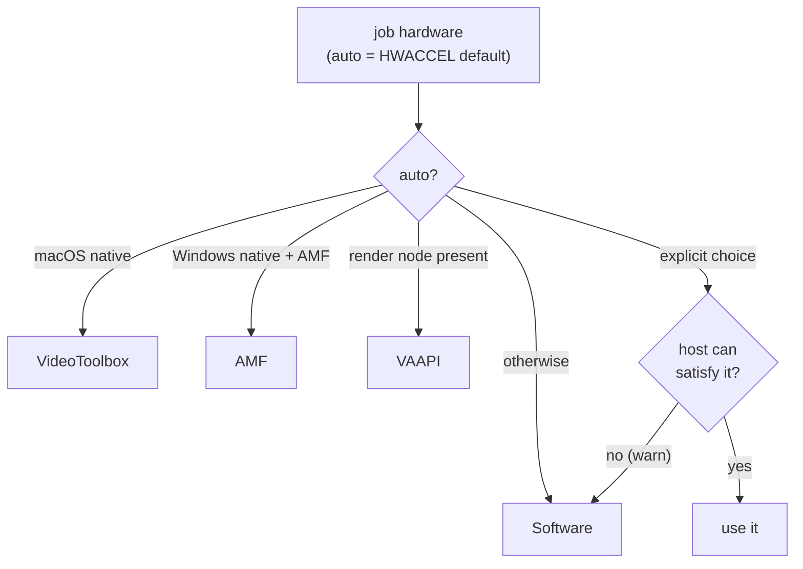

# Hardware Acceleration

Status: Implemented
Created: 2026-07-03
Updated: 2026-07-20

## Description

Hardware encoding is the reason this engine is a separate app. Which encoder is
reachable depends on **where and how** the engine runs: a passed-through `/dev/dri`
render node (Linux, in docker), or a host-native ffmpeg with access to the platform
frameworks (VideoToolbox on macOS, AMF on Windows). This doc covers the encoder
families, the host probe (`Transcoding/HardwareProbe.cs`), the auto-detection and
per-request resolution (`FfmpegTranscodeEngine.ResolveHardware`), and the software
fallback that keeps a job from ever hard-failing on a missing accelerator.

The guiding rule: **hardware is opportunistic, software is guaranteed.** An explicit
encoder the host cannot satisfy falls back to `libx264`/`libx265` with a warning, not
a failure. What was *actually* selected is reported per job as `effectiveHardware`
and logged (`Job …: encoding with hevc_vaapi (vaapi)`), so a consumer can confirm
hardware is really in effect.

## The encoders and how each is reached

| Encoder | Runtime profile | How it is reached |
| --- | --- | --- |
| **VAAPI** (Intel / AMD, Linux) | `docker-vaapi` | A passed-through `/dev/dri` render node (manifest `devices`). Opt-in profile — Docker hard-fails container creation when `--device /dev/dri` is missing, so the default profile carries none. |
| **VideoToolbox** (Apple) | `local` (native) | The engine runs natively on macOS via the `localCommand` runtime; the host's `ffmpeg` reaches VideoToolbox directly. Unreachable from any docker profile (Docker on macOS is a Linux VM with no GPU). |
| **AMF** (AMD, Windows) | `local` (native) | The engine runs natively on Windows; the host's `ffmpeg` hardware-decodes on the AMD VCN via D3D11VA and encodes with `*_amf`. The path for AMD on Windows, where VAAPI does not exist. |
| **Software** (libx264 / libx265) | `docker` (default), or any fallback | No hardware needed. Starts on any host, including macOS Docker Desktop. |

See [Hosty runtime app](hosty-runtime-app.md#runtime-profiles) for the profiles and
[Build and deployment](build-and-deployment.md#running-under-each-runtime) for how to
launch each.

## The host probe (`HardwareProbe`)

`HardwareProbe.Detect` reports what the host offers, without spawning a process — it
is informational (it backs `GET /hardware`) and feeds auto-detection, but is never a
correctness gate:

- **VAAPI** — enumerates `/dev/dri/renderD*`. `vaapiAvailable` is true when the
  configured `VAAPI_DEVICE` exists or any render node was found; `vaapiDevice` is the
  configured node if present, else the first discovered one.
- **VideoToolbox** — `videoToolboxAvailable` is simply `OperatingSystem.IsMacOS()`:
  the .NET process only reports macOS when running natively, which is exactly where
  VideoToolbox is reachable.
- **AMF** — `amfAvailable` is true only on native Windows where the AMD driver's
  `amfrt64.dll` (in System32) is present — the signal that the `*_amf` encoders can
  initialise. A probe error is swallowed and reported as "no AMF" so it can never
  crash startup or a request.

Inside the Linux docker container `videoToolboxAvailable` and `amfAvailable` are
always false; `vaapiAvailable` reflects whether the `/dev/dri` passthrough worked.

## Resolution and fallback (`ResolveHardware`)

Each job's `hardwareAcceleration` (or the `HWACCEL` default when `auto`) is resolved
against a single host probe:

- **`auto`** picks VideoToolbox on a native macOS host, AMF on a native Windows host
  whose AMD driver ships the runtime, VAAPI when a Linux render device is present, and
  software otherwise.
- **An explicit choice** is honoured only if the host can satisfy it: `vaapi` needs a
  render device, `videotoolbox` needs native macOS, `amf` needs the native-Windows AMF
  runtime. If not, the engine logs a warning and returns software (`None`) — the job
  still runs.

## Encoder families and the encode chain

For a re-encode (not a `copy`), `AddVideoEncode` maps the codec + hardware to the
encoder and wires the right scaler for an optional `maxHeight` downscale:

| Hardware | h264 | hevc | Decode / scale |
| --- | --- | --- | --- |
| VAAPI | `h264_vaapi` | `hevc_vaapi` | Software-decode → `format=nv12,hwupload` → `scale_vaapi` on the GPU. The proven chain, most compatible across arbitrary inputs. |
| VideoToolbox | `h264_videotoolbox` | `hevc_videotoolbox` | System-memory frames; CPU `scale=-2:H`. |
| AMF | `h264_amf` | `hevc_amf` | D3D11VA hardware-decode → `hwdownload,format=nv12\|p010` → CPU `scale=-2:H`. |
| Software | `libx264` | `libx265` | CPU decode + `scale=-2:H`; honours `crf`. |

The VAAPI path keeps scaling on the GPU (`scale_vaapi=w=-2:h=H` inside the hwupload
chain); every other path hands the encoder system-memory frames, so a plain CPU
`scale=-2:H` (aspect kept, width snapped to an even number) fits. The caller is
expected to omit `maxHeight` when the source is already at or below the target, so the
downscale never upscales. `crf` applies only to the software encoders; the hardware
encoders ignore it.

## Why hardware is opportunistic but honest

ffmpeg errors out if it cannot initialise a `*_vaapi` / `*_videotoolbox` / `*_amf`
device — it never silently falls back to software mid-run. So a job whose
`effectiveHardware` is a hardware family **and** reaches `Completed` definitely used
hardware. The engine's own fallback happens *before* the run (in `ResolveHardware`),
which is why the per-job log line and `effectiveHardware` snapshot field report the
resolved encoder rather than the requested one.

## Testing Expectations

Backend tests use xUnit and Imposter. The scaler/encoder wiring is unit-testable
through the pure `BuildArguments` (VAAPI GPU scale vs. software CPU scale, copy
bypassing hwaccel — see [Transcode engine](transcode-engine.md#testing-expectations)),
as is the `HWACCEL` value parsing (`TranscodeEngineSettingsTests.ParseHardware`, incl.
aliases and unknown → null). The actual device init and encode
(`Detect` against real `/dev/dri`, VideoToolbox/AMF availability) depends on real host
hardware and is validated at the runtime level, not by unit tests.
