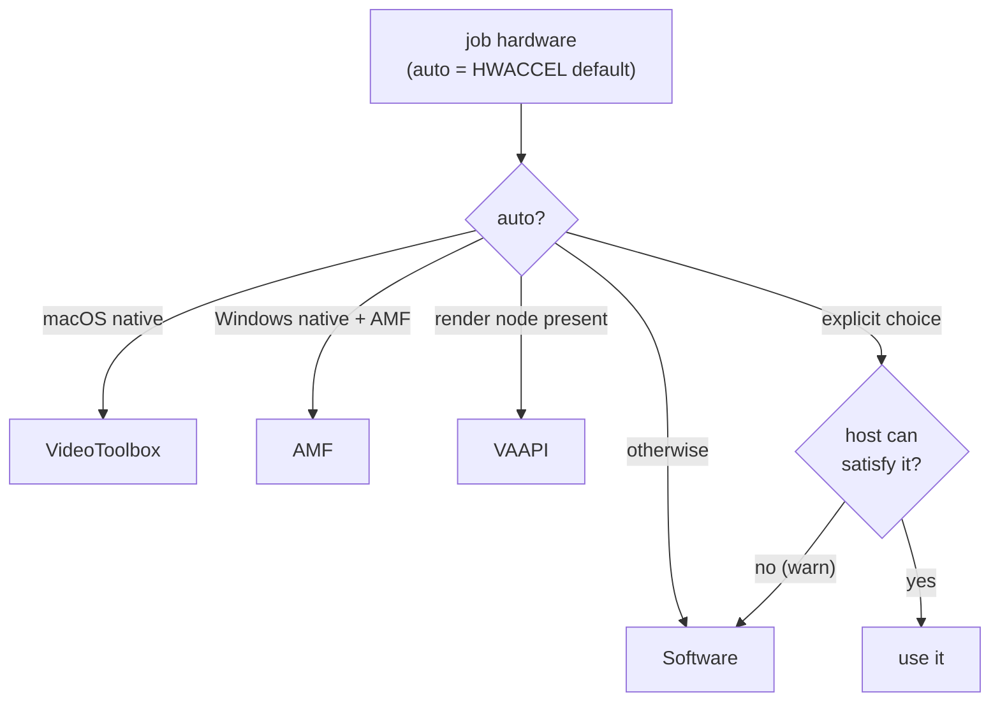

# Hardware Acceleration

Created: 2026-07-03
Updated: 2026-08-06

## Description

Hardware encoding is the reason this engine is a separate app. Which encoder is
reachable depends on **where and how** the engine runs: a passed-through `/dev/dri`
render node (Linux, in docker), or a host-native ffmpeg with access to the platform
frameworks (VideoToolbox on macOS, AMF on Windows). This doc covers the encoder
families, the host probe (`Transcoding/HardwareProbe.cs`), the auto-detection and
per-request resolution (`FfmpegTranscodeEngine.ResolveHardware`), and the software
fallback that keeps a job from ever hard-failing on a missing accelerator.

The guiding rule: **hardware is opportunistic, software is guaranteed.** An explicit
encoder the host cannot satisfy falls back to `libx264`/`libx265` with a warning, not
a failure. What was *actually* selected is reported per job as `effectiveHardware`
and logged (`Job …: encoding with hevc_vaapi (vaapi)`), so a consumer can confirm
hardware is really in effect.

## The encoders and how each is reached

| Encoder | Runtime profile | How it is reached |
| --- | --- | --- |
| **VAAPI** (Intel / AMD, Linux) | `docker-vaapi` | A passed-through `/dev/dri` render node (manifest `devices`). Opt-in profile — Docker hard-fails container creation when `--device /dev/dri` is missing, so the default profile carries none. |
| **VideoToolbox** (Apple) | `local` (native) | The engine runs natively on macOS via the `localCommand` runtime; the host's `ffmpeg` reaches VideoToolbox directly. Unreachable from any docker profile (Docker on macOS is a Linux VM with no GPU). |
| **AMF** (AMD, Windows) | `local` (native) | The engine runs natively on Windows; the host's `ffmpeg` hardware-decodes on the AMD VCN via D3D11VA and encodes with `*_amf`. The path for AMD on Windows, where VAAPI does not exist. |
| **Software** (libx264 / libx265) | `docker` (default), or any fallback | No hardware needed. Starts on any host, including macOS Docker Desktop. |

See [Hosty runtime app](../hosty-runtime-app.md#runtime-profiles) for the profiles and
[Build and deployment](../build-and-deployment.md#running-under-each-runtime) for how to
launch each.

## The host probe (`HardwareProbe`)

`HardwareProbe.Detect` reports what the host offers, without spawning a process — it
is informational (it backs `GET /hardware`) and feeds auto-detection, but is never a
correctness gate:

- **VAAPI** — enumerates `/dev/dri/renderD*`. `vaapiAvailable` is true when the
  configured `VAAPI_DEVICE` exists or any render node was found; `vaapiDevice` is the
  configured node if present, else the first discovered one.
- **VideoToolbox** — `videoToolboxAvailable` is simply `OperatingSystem.IsMacOS()`:
  the .NET process only reports macOS when running natively, which is exactly where
  VideoToolbox is reachable.
- **AMF** — `amfAvailable` is true only on native Windows where the AMD driver's
  `amfrt64.dll` (in System32) is present — the signal that the `*_amf` encoders can
  initialise. A probe error is swallowed and reported as "no AMF" so it can never
  crash startup or a request.

Inside the Linux docker container `videoToolboxAvailable` and `amfAvailable` are
always false; `vaapiAvailable` reflects whether the `/dev/dri` passthrough worked.

## Resolution and fallback (`ResolveHardware`)

Each job's `hardwareAcceleration` (or the `HWACCEL` default when `auto`) is resolved
against a single host probe:



- **`auto`** picks VideoToolbox on a native macOS host, AMF on a native Windows host
  whose AMD driver ships the runtime, VAAPI when a Linux render device is present, and
  software otherwise.
- **An explicit choice** is honoured only if the host can satisfy it: `vaapi` needs a
  render device, `videotoolbox` needs native macOS, `amf` needs the native-Windows AMF
  runtime. If not, the engine logs a warning and returns software (`None`) — the job
  still runs.

## Encoder families and the encode chain

For a re-encode (not a `copy`), `AddVideoEncode` maps the codec + hardware to the
encoder and wires the right scaler for an optional `maxHeight` downscale:

| Hardware | h264 | hevc | Decode / scale |
| --- | --- | --- | --- |
| VAAPI | `h264_vaapi` | `hevc_vaapi` | Software-decode → `format=<nv12\|p010>,hwupload` → `scale_vaapi` on the GPU. The proven chain, most compatible across arbitrary inputs; the upload format tracks the source depth (below). |
| VideoToolbox | `h264_videotoolbox` | `hevc_videotoolbox` | System-memory frames; CPU `scale=-2:H`. |
| AMF | `h264_amf` | `hevc_amf` | D3D11VA hardware-decode with `-hwaccel_output_format` unset, so the decoder downloads each surface into its own software format (`nv12` / `p010`) → CPU `scale=-2:H`. |
| Software | `libx264` | `libx265` | CPU decode + `scale=-2:H`. |

The VAAPI path keeps scaling on the GPU (`scale_vaapi=w=-2:h=H` inside the hwupload
chain); every other path hands the encoder system-memory frames, so a plain CPU
`scale=-2:H` (aspect kept, width snapped to an even number) fits. The caller is
expected to omit `maxHeight` when the source is already at or below the target, so the
downscale never upscales.

## Rate control

Every family carries rate control, expressed as the job's `qualityLevel` in that
family's own dialect. This is what makes the opportunistic fallback below honest: a
job that lands on another encoder than it expected keeps asking for the same picture.

| Family | Arguments |
| --- | --- |
| Software | `-crf N` |
| AMF | `-rc cqp -qp_i N -qp_p N` — CQP is the only quality-style mode it offers; `qvbr`, `hqvbr`, `vbr_peak` with VBAQ and CQP with pre-analysis all fail encoder init with `AMF_NOT_SUPPORTED`. |
| VAAPI | `-rc_mode CQP -qp N` |
| VideoToolbox | `-q:v N`, on an inverted scale where higher is better. Not available on every host; where it is missing the job fails rather than encoding at the driver default. |

The level → value tables and the measurements behind them are in
[Compression controls](../compression-controls/feature.md). The short version:
software and AMF came out equivalent in quality per byte at a 30–70× speed
difference, so hardware is a legitimate choice for shrinking a file, not only for
finishing sooner.

## Bit depth on the VAAPI upload

The format named before `hwupload` becomes the VAAPI surface's `sw_format`, and with
it the depth the encoder is handed — the conversion happens in software, in the filter
graph, *before* any frame reaches the GPU. So `format=nv12` is an unconditional
truncation to 8 bit, and on a 10-bit HDR source it costs a bit of depth silently: the
job succeeds, `effectiveHardware` still says `vaapi`, and the only symptom is banding
on the gradients HDR material is full of.

The upload format therefore follows the source, which `CreateAsync` reads from the
primary video stream's `pix_fmt` at job-creation time and the job carries into
`BuildArguments`:

| Source | Target codec | Upload | Profile |
| --- | --- | --- | --- |
| deeper than 8-bit (`yuv420p10le`, `p010le`, …) | `hevc` | `format=p010` | `-profile:v main10` |
| deeper than 8-bit | `h264` | `format=nv12` | encoder default |
| 8-bit, or a `pix_fmt` the probe could not read | either | `format=nv12` | encoder default |

Two deliberate limits:

- **H.264 stays 8-bit.** No shipping VAAPI driver exposes an H.264 High 10 *encode*
  entrypoint, so uploading `p010` there would turn a job that works today into a hard
  "no usable encoding profile" failure. A caller who wants the 10 bits asks for HEVC.
- **An unrecognised `pix_fmt` reads as 8-bit** (`SourceBitDepth`), so a format the
  parser does not model can only ever keep the pre-existing `nv12` path, never
  mis-select `p010`.

## The Main 10 capability probe

A render node is not a promise of Main 10: an Intel GPU before Kaby Lake exposes a
perfectly good VAAPI device whose HEVC encoder is Main-only. That is the one hardware
question `HardwareProbe.Detect` cannot answer from the filesystem, and getting it wrong
either way is bad — a hard encoder-init failure breaks the "hardware degrades to
software" guarantee, and silently truncating to 8 bit is the bug this section exists
to fix.

So a job that would ask for Main 10 (`NeedsVaapiTenBit`: a VAAPI *re-encode* of a
deeper-than-8-bit source to HEVC — never a remux, an 8-bit source, or H.264) first
checks the capability, and falls back to software when the answer is no:

```text
Job …: VAAPI is available but its HEVC encoder cannot do Main 10, and the source is
yuv420p10le; falling back to software so the encode keeps its bit depth.
```

The check is a throwaway encode of a few generated frames through the exact chain a
real job would use — `format=p010,hwupload` → `hevc_vaapi -profile:v main10` — and it
passes only when ffmpeg exits cleanly. A driver self-report (`vainfo`) would be
cheaper but less conclusive; this fails exactly when the job would have failed.
Anything else — a Main-only encoder, a wedged device, an ffmpeg that will not start, a
probe that outruns its 20s timeout — reads as "no Main 10", which costs speed but never
correctness.

It runs at most once per process, lazily: a host that never submits a 10-bit HEVC job
never spawns it, and one that does pays for it on the first such job only. This is the
only probe that spawns a process, which is why it lives on the engine rather than in
`HardwareProbe` — `GET /hardware` stays free of it and keeps reporting device presence,
while the job's `effectiveHardware` reports `software` whenever this fallback fires.

## Why hardware is opportunistic but honest

ffmpeg errors out if it cannot initialise a `*_vaapi` / `*_videotoolbox` / `*_amf`
device — it never silently falls back to software mid-run. So a job whose
`effectiveHardware` is a hardware family **and** reaches `Completed` definitely used
hardware. Every fallback the engine performs happens *before* the run — in
`ResolveHardware` for a family the host cannot reach, and in the Main 10 check above
for a capability the render node does not imply — and both land before `job.Start`,
which is why the per-job log line and the `effectiveHardware` snapshot field report
the encoder actually used rather than the one requested.

## Testing Expectations

Backend tests use xUnit and Imposter. The scaler/encoder wiring is unit-testable
through the pure `BuildArguments` (VAAPI GPU scale vs. software CPU scale, copy
bypassing hwaccel, and the `nv12`/`p010` upload choice with its `main10` profile — see
[Transcode engine](../transcode-engine/feature.md#testing-expectations)),
as is the `HWACCEL` value parsing (`TranscodeEngineSettingsTests.ParseHardware`, incl.
aliases and unknown → null). `NeedsVaapiTenBit` — which decides whether the Main 10
capability probe is consulted at all — is pure and unit-tested across remux, depth,
codec and hardware family. The actual device init and encode (`Detect` against real
`/dev/dri`, the capability probe's verdict, VideoToolbox/AMF availability) depends on
real host hardware and is validated at the runtime level, not by unit tests.

The upload-format change is verified end-to-end by encoding a 10-bit HDR sample on a
host with a `/dev/dri` render node and reading the result back:

```bash
ffprobe -v error -select_streams v:0 -show_entries stream=pix_fmt,profile -of default=nw=1 <output>
```

`yuv420p10le` / `Main 10` is the fixed behaviour; `yuv420p` / `Main` is the bug. The
software half of the chain — that `format=nv12` truncates a `yuv420p10le` decode to 8
bit *before* `hwupload`, which is where the depth is actually lost — reproduces on any
host, with no render node, by running the same `-vf` against a software encoder.
