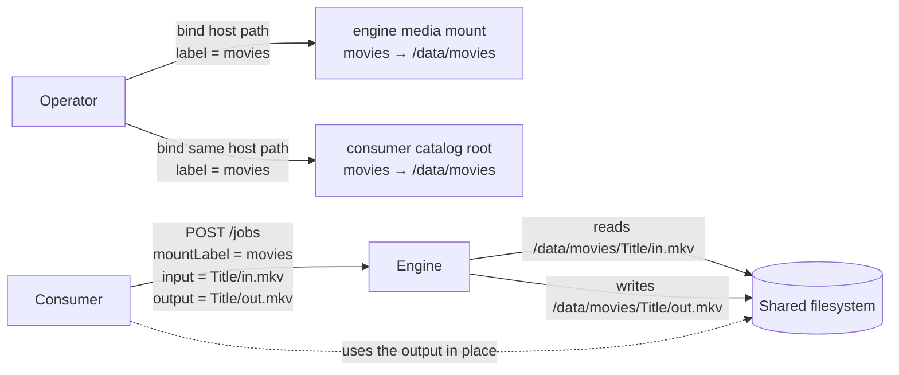

# Media Mounts and Path Resolution

Status: Implemented
Created: 2026-07-03
Updated: 2026-07-03

## Description

A consumer transcodes with this engine so it can then use the result in its own
library — which means the engine must read the input and write the output on a
filesystem the consumer shares. This doc covers how a job's input/output are routed
to the right filesystem via labelled mounts, and how path resolution is kept safe
(`Transcoding/TranscodeEngineSettings.cs`).

The engine stays ignorant of the consumer's catalogs: it is told only a
`mountLabel` + a relative path (input and output separately) and resolves them
against its own labelled media roots.

## The mount-label contract

The `media` external mount is declared `multiple` in the manifest, so the operator
binds **one host path per catalog filesystem**. Hosty has no cross-app mount sharing
— each app configures its mounts independently — so the **label** is the only key
shared between the engine and its consumer:

- The operator binds each host path into the engine's `media` mount with the **same
  label** the consumer uses for the matching catalog root.
- The consumer sends that label as `inputMountLabel` (and optionally a different
  `outputMountLabel`) on `POST /jobs`.
- The engine resolves the relative input/output paths against the root registered
  under that label, keeping the job's read and write on the same filesystem as the
  consumer's library.

`outputMountLabel` defaults to `inputMountLabel`, so a same-directory transcode
(the common case) needs only one label; a cross-filesystem job (read from one
catalog, write to another) sets both.

## Label resolution and injection

Core injects the mounts as `HOSTY_MOUNT_MEDIA`: a comma-joined list of `label=path`
entries (container paths under docker). `ParseMediaRoots` turns this into a
case-insensitive `label → absolute root` map:

- Each entry is split on the **first** `=` only (a host path may itself contain `=`).
- An entry with no `=` (an older Core that injected bare paths), or a blank explicit
  label, falls back to the path's base name as its label.
- An entry that still has no usable label (e.g. a bare filesystem root) is **skipped**
  rather than stored under an unreachable empty key.
- With **no** mount injected (a standalone / dev run), a single unlabeled fallback
  root is used at `{HOSTY_APP_DATA_DIR}/media`, so the engine still runs.

`ResolveMediaPath(mountLabel, relativePath)` then picks the root:

- **Label given** → the matching root, or an `ArgumentException` (a `400` at the API)
  naming the configured labels if it is unknown — so a job never reads or writes on
  the wrong filesystem, and the operator gets an actionable message.
- **No label** → allowed only when there is exactly **one** root (a single mount, or
  the standalone fallback). With several roots, a missing label is a `400` (it would
  be ambiguous which filesystem to touch).

## Traversal safety

Once a root is chosen, the request path is resolved against it and **guaranteed to
stay inside** it. A relative path is combined with the root; an absolute path is taken
as-is; then the result must equal the root or start with `root + DirectorySeparator`.
Anything that escapes — `../..`, or an absolute path outside the root — is rejected
with an `ArgumentException` (a `400`). This prevents a job from reading or writing
off-mount regardless of what the consumer sends. A blank path is rejected outright.

Both the input and the output go through `ResolveMediaPath`, so both are pinned inside
a media root; the endpoint additionally checks the input exists and that the resolved
output differs from the input.

## Why this keeps the hand-off on one filesystem

The engine reads `<input-root>/<inputPath>` and writes `<output-root>/<outputPath>`.
Because the operator bound the **same host path** into both the engine and the
consumer under the same label, those paths are on the same filesystem the consumer's
catalog lives on — so the consumer can pick up the finished output in place, with no
cross-container copy. An unknown label failing loudly (`400`) rather than silently
landing on the wrong mount is what keeps this guarantee honest.

## Testing Expectations

Backend tests use xUnit and Imposter. Required coverage
(`TranscodeEngineSettingsTests`):

- `ParseMediaRoots`: `label=path` parsing, first-`=` split when the path contains
  `=`, base-name fallback for unlabeled/blank-label entries, and the standalone
  single-fallback-root case.
- `ResolveMediaPath`: single-root label-optional, multi-root label-required,
  case-insensitive label match, unknown label → error listing configured labels,
  relative path joined under the root, blank path rejected, and `../` traversal
  outside the root rejected.
- The endpoint-level checks (input-exists, output ≠ input, unknown label surfaced as
  `400`) are covered in [Control API](control-api.md).
