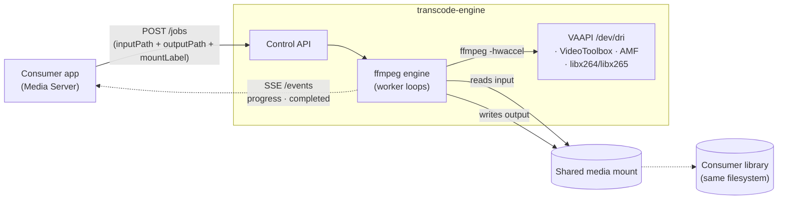
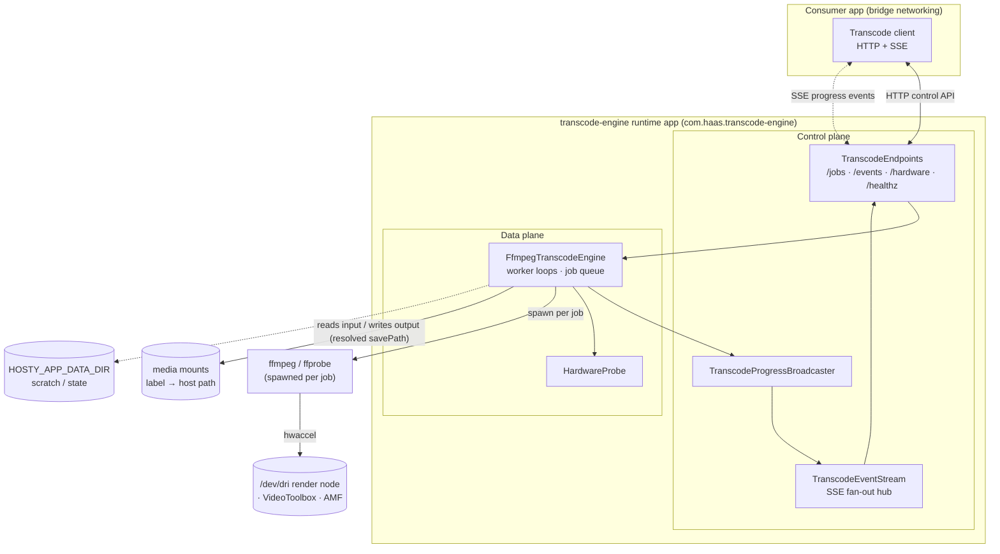

# Transcode Engine Documentation

## Overview

Transcode Engine is a standalone [Hosty](https://github.com/alex-de-haas/docker-host)
runtime app: an **ffmpeg-backed batch transcoder** that exposes an HTTP/SSE
**control API** for other Hosty apps to drive re-encoding jobs over a cross-app
dependency. It is the sibling of
[Torrent Engine](https://github.com/alex-de-haas/torrent-engine) — same shape (a
single job/SSE control API, a shared host-path mount for zero-copy file hand-off,
and a consumer that drives it as a dependency) — and this documentation describes an
**implemented** app (`manifest.json` `version` `0.4.0`); each feature doc is marked
`Status: Implemented` and reflects the code in `src/TranscodeEngine.Api/`.

The defining goal is **isolating hardware encoding and its resource cost** from the
consumer. Running transcoding in its own container (or as a native side process)
solves two problems at once:

1. **Hardware-encoding isolation.** VAAPI hardware encoding needs a host `/dev/dri`
   render node passed into the container; VideoToolbox and AMF need the engine to run
   natively on the host. Confining that privileged / host-native passthrough to one
   small, single-purpose app keeps it out of the consumer, which holds the database,
   tokens, and the media-serving surface.
2. **Resource isolation.** Encoding is CPU/GPU-bound and long-running. Its own
   process means it never competes with the consumer's request-serving loop and is
   not killed by the consumer's restart/backup — while the consumer stays free to
   restart independently.

The intended first consumer is
[Media Server](https://github.com/alex-de-haas/media-server); the engine-side
contract here is complete, and the consumer's job/UI wiring is the remaining work
(see [Consumer integration](features/consumer-integration.md)).

## Primary Use Case

## High-Level Architecture

## Technology Stack

Engine (`engine` service):

- .NET 10 ASP.NET Core Minimal API, published as a framework-dependent app on the
  `aspnet:10.0` runtime image. JSON via `System.Text.Json` (web defaults).
- [ffmpeg](https://ffmpeg.org/) / ffprobe, spawned as a child process per job. The
  engine parses ffmpeg's `-progress` key/value stream into live snapshots and reads
  input duration from ffprobe.
- A bounded set of worker loops draining an in-memory job queue, run as a hosted
  service (`MAX_CONCURRENT_JOBS`, default 1 — hardware encoders have limited
  sessions).
- Server-Sent Events for real-time progress and state transitions (server→client
  only); an in-memory fan-out hub with per-subscriber bounded channels.
- OpenTelemetry (traces, metrics, logs over OTLP/HTTP), opt-in and entirely driven
  by the `OTEL_*` environment Hosty Core injects.

Runtime and delivery:

- Hosty runtime app manifest (`manifest.json`, `schemaVersion: "app.0.1"`) with
  **three** runtime profiles: `docker` (default, software encoding, starts
  everywhere), `docker-vaapi` (adds the `/dev/dri` device for Linux hardware
  encoding), and `local` (a native `localCommand` run for host-native encoders —
  VideoToolbox on macOS, AMF on Windows).
- A two-stage Dockerfile: a .NET SDK build stage, and an `aspnet` runtime stage that
  installs ffmpeg + the VA-API userspace stack (`mesa-va-drivers`, covering Intel
  iHD/i965 and AMD radeonsi).
- GitHub Actions for build/test (`ci.yml`) and multi-arch image publishing to GHCR
  (`publish.yml`).

## Ideas

No idea documents yet.

## Features

- [Control API](features/control-api.md) — HTTP endpoints, the create-job
  request/response contracts, the per-job snapshot, and the SSE event stream.
- [Transcode engine](features/transcode-engine.md) — the `FfmpegTranscodeEngine`:
  the job queue and worker loops, lifecycle, ffmpeg argument construction, progress
  parsing, and state→event mapping.
- [Hardware acceleration](features/hardware-acceleration.md) — VAAPI / VideoToolbox /
  AMF / software, the host probe, auto-detection, and the software fallback.
- [Media mounts and path resolution](features/media-mounts.md) — labelled
  multi-mount routing, input/output `savePath` resolution, and traversal safety.
- [Hosty runtime app](features/hosty-runtime-app.md) — the manifest, the three
  runtime profiles, devices, settings, app data, and telemetry.
- [Consumer integration](features/consumer-integration.md) — how a consumer declares
  the dependency, discovers the engine, shares mounts, and tolerates its absence.
- [Configuration](features/configuration.md) — the full environment-variable
  reference.
- [Build and deployment](features/build-and-deployment.md) — the Dockerfile, the
  entrypoint, CI/publish, and local development across the runtimes.

## Testing Expectations

Backend unit tests must use xUnit; dependencies are mocked with
[Imposter](https://www.nuget.org/packages/Imposter). Endpoint tests host
`MapTranscodeEndpoints` on an in-memory `TestServer`
(`Microsoft.AspNetCore.TestHost`) with a mocked `ITranscodeEngine`, so no ffmpeg
process is spawned. ffmpeg argument construction is unit-tested directly through the
pure `BuildArguments`. Actual hardware encoding (VAAPI / VideoToolbox / AMF) depends
on real host devices and is validated at the runtime level, not by unit tests.
Feature-specific testing requirements are documented in the relevant feature files.

## Roadmap

- **Shipped.** ffmpeg worker-pool engine, HTTP/SSE control API, VAAPI (docker) /
  VideoToolbox (native macOS) / AMF (native Windows) / software encoding with
  auto-detection and software fallback, video copy/remux, resolution downscale,
  per-type audio/subtitle stream selection and default-track disposition, multiple
  labelled media mounts, a host hardware probe, and OTLP telemetry.
- **Consumer wiring.** Media Server ships a transcode client but still needs a
  job/UI surface to actually request transcodes — see
  [Consumer integration](features/consumer-integration.md).
- **Encode options.** Audio re-encode is not yet exposed (audio is always
  `-c:a copy`); resolution scaling is in, further filters are on demand.
- **More encoders.** NVENC / QSV beyond VAAPI (NVENC needs the NVIDIA Container
  Toolkit, a separate docker-host feature).
- **Cross-app auth/routing.** The `control` endpoint is non-public; reaching it
  across containers needs the planned shared cross-app docker network — see
  [Consumer integration](features/consumer-integration.md).

## Non-Goals

- Media organization, identification, metadata, or streaming — those belong to the
  consumer (Media Server), not the engine.
- Content discovery or a transcoding UI (the engine is driven by a consumer, not by
  end users).
- Persisting job progress or history — snapshots are live and in-memory; a job that
  outlives the process is not resumed. The consumer persists the transitions it
  cares about.
- Bundling encoders the host does not provide — hardware encoding depends on a
  passed-through render node or a host-native ffmpeg; without them the engine encodes
  in software.

## Summary

Transcode Engine is a focused, ffmpeg-backed batch transcoder exposed as a Hosty
runtime app. Its center of gravity is the split between a **control plane** (an
HTTP/SSE API a consumer drives) and a **data plane** (a pool of worker loops that
spawn ffmpeg per job, pick the best available encoder, and stream progress). A
consumer creates a job against a labelled shared mount, watches progress over SSE,
and finds the finished file on the same filesystem its library lives on — while the
engine keeps hardware-encoding privileges and the encode's resource cost out of the
consumer's process.
